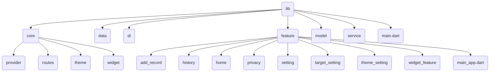

# Gulu Water
紀錄飲水量 APP
Gulu Water 是一款幫助用戶追蹤每日飲水紀錄的健康管理應用程式。透過簡單的操作，使用者可以新增、檢視、分析飲水量，並透過獎杯系統提升記錄的動力！

## 🚀 功能介紹

-  記錄每日飲水量
-  以日期分類顯示紀錄
-  一週飲水趨勢圖表
-  根據達成率顯示獎杯圖示
-  主題色切換功能
-  支援清除資料與隱私說明

## 專案架構

## 套件
- flutter_riverpod: ^2.5.1
- google_fonts: ^6.2.1
- dio: ^5.4.3+1
- get_it: ^7.7.0
- skeletonizer: ^2.1.0
- fluttertoast: ^8.2.1
- numberpicker: ^2.1.1
- photo_view: ^0.14.0
- image_picker: ^1.1.2
- shared_preferences: ^2.5.3
- sqflite: ^2.4.2
- path: ^1.9.1
- path_provider: ^2.1.5
- image: ^4.5.4
- collection: ^1.18.0
- cupertino_icons: ^1.0.8
- percent_indicator: ^4.2.5
- fl_chart: ^1.0.0
- flutter_launcher_icons: ^0.13.1

# View

  
  
  

  
  
  

