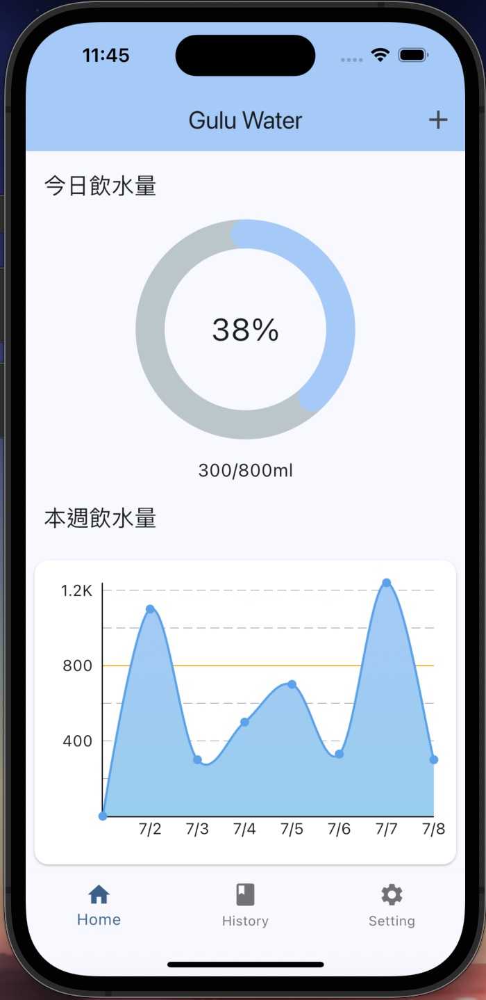
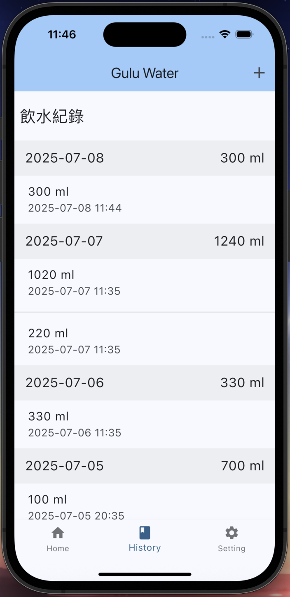
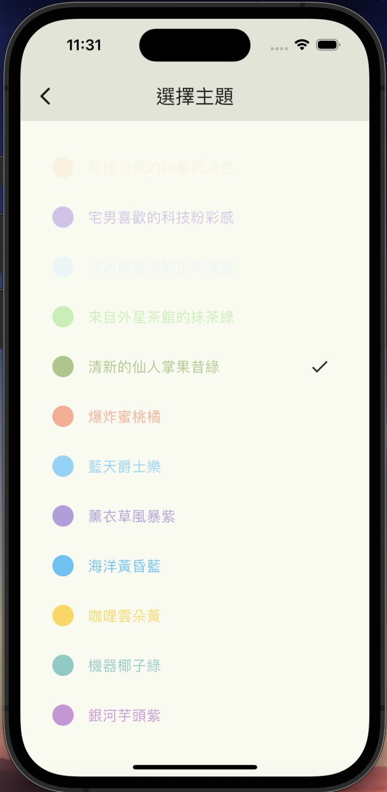
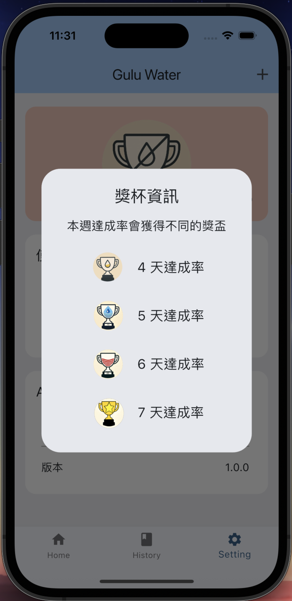

# Gulu Water
紀錄飲水量 APP
Gulu Water 是一款幫助用戶追蹤每日飲水紀錄的健康管理應用程式。透過簡單的操作，使用者可以新增、檢視、分析飲水量，並透過獎杯系統提升記錄的動力！

## 🚀 功能介紹

-  記錄每日飲水量
-  以日期分類顯示紀錄
-  一週飲水趨勢圖表
-  根據達成率顯示獎杯圖示
-  主題色切換功能
-  支援清除資料與隱私說明

## 專案架構
lib/
├── core/                      # 共用核心模組（主題、路由、Provider 等）
│   ├── provider/              # Riverpod 狀態管理
│   ├── routes/                # 路由與頁面路徑定義
│   ├── theme/                 # 主題樣式與色彩定義
│   └── widget/                # 通用的 UI 元件
│
├── data/                      # 本地資料來源層（可用來管理 sqflite 或 json 資料）
│
├── di/                        # 相依性注入（Dependency Injection）
│
├── feature/                   # 功能模組（依功能區分畫面與邏輯）
│   ├── add_record/            # 新增紀錄功能
│   ├── history/               # 紀錄歷史查詢與分組畫面
│   ├── home/                  # 首頁功能
│   ├── privacy/               # 隱私權條款頁面
│   ├── setting/               # 一般設定畫面
│   ├── target_setting/        # 目標設定畫面
│   ├── theme_setting/         # 主題色設定畫面
│   └── widget/                # 專屬 feature 的 UI 小元件
│   └── main_app.dart          # App Scaffold 主頁
│
├── model/                     # 資料模型（如 WaterRecord、設定等）
│
├── service/                   # 封裝的資料存取與邏輯服務（SharedPreferences、資料庫）
│
├── main.dart                  # App 進入點，初始化與註冊路由

## 套件
flutter_riverpod: ^2.5.1
google_fonts: ^6.2.1
dio: ^5.4.3+1
get_it: ^7.7.0
skeletonizer: ^2.1.0
fluttertoast: ^8.2.1
numberpicker: ^2.1.1
photo_view: ^0.14.0
image_picker: ^1.1.2
shared_preferences: ^2.5.3
sqflite: ^2.4.2
path: ^1.9.1
path_provider: ^2.1.5
image: ^4.5.4
collection: ^1.18.0
cupertino_icons: ^1.0.8
percent_indicator: ^4.2.5
fl_chart: ^1.0.0
flutter_launcher_icons: ^0.13.1

# View

  
  
  

  
  
  

